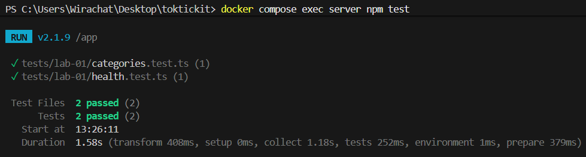
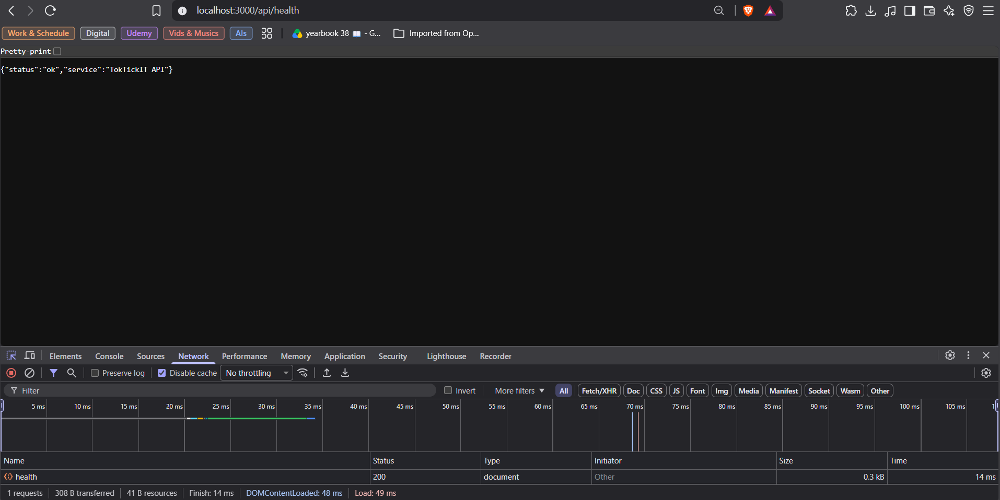
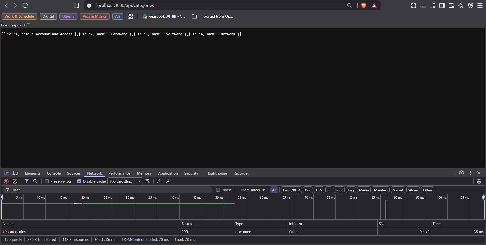
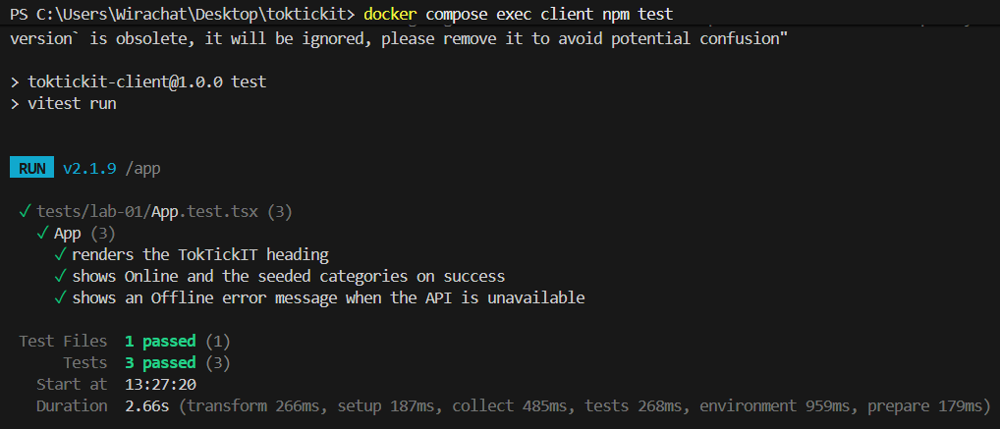
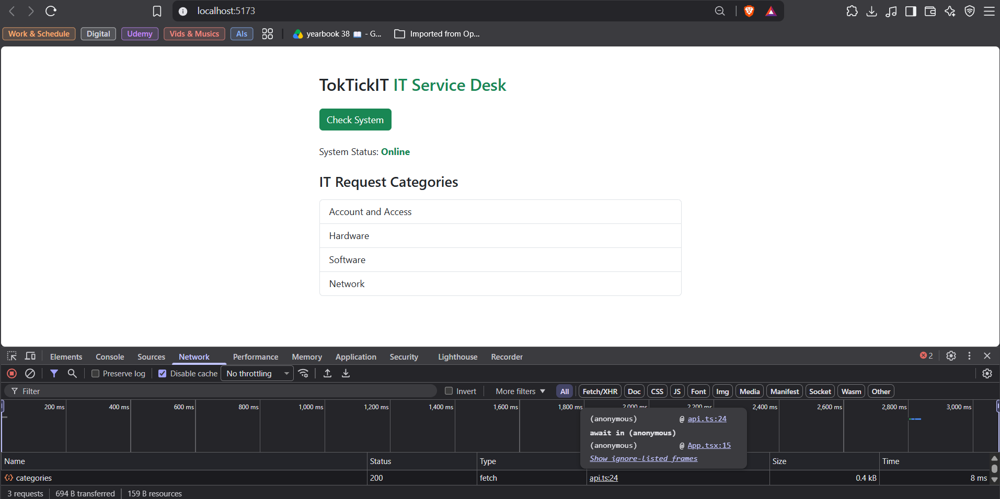
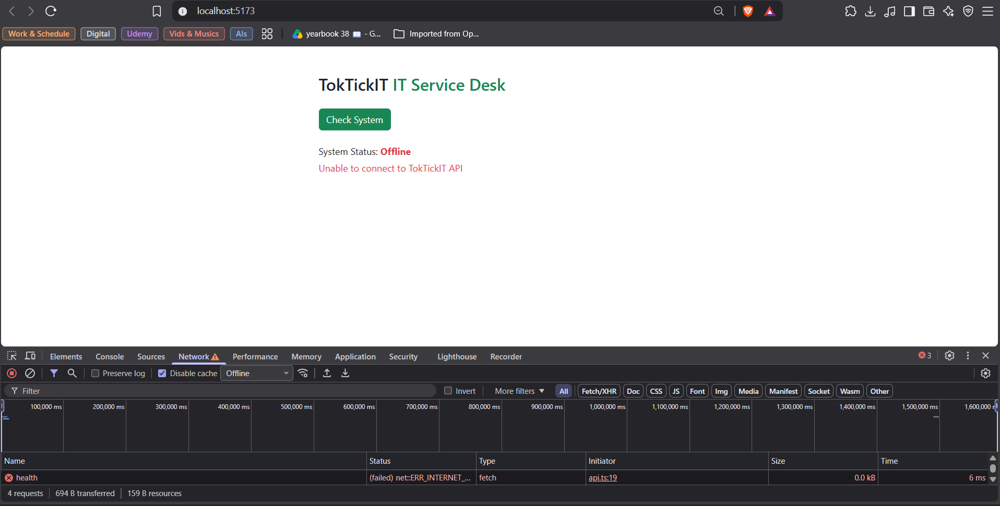

# Lab 1 — Test Plan and Evidence  (fill this in)

All test files live under server/tests/lab-01/ and client/tests/lab-01/.

| # | Tool | Test | Result |
|---|------|------|--------|
| 1 | Supertest | GET /api/health returns 200, status=ok | ✅ Passed |
| 2 | Supertest | GET /api/categories returns 4 seeded categories in id order | ✅ Passed |
| 3 | Vitest | Heading renders | ✅ Passed |
| 4 | Vitest | Success state shows Online + category list | ✅ Passed |
| 5 | Vitest | Error state shows Offline + message | ✅ Passed |

Paste your passing terminal output / screenshot below.

**Backend Tests (Server + Supertest):**

server\tests\lab-01 results

localhost:3000/api/health results

localhost:3000/api/categories results

**Frontend Tests (Client + Vitest):**

client\tests\lab-01 results

localhost:5173 results when API loaded successfully

localhost:5173 results when API failed to load